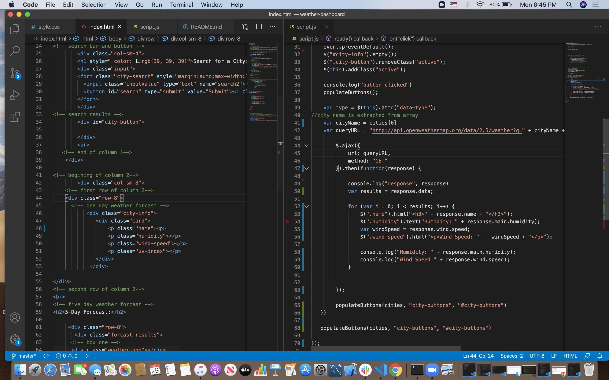
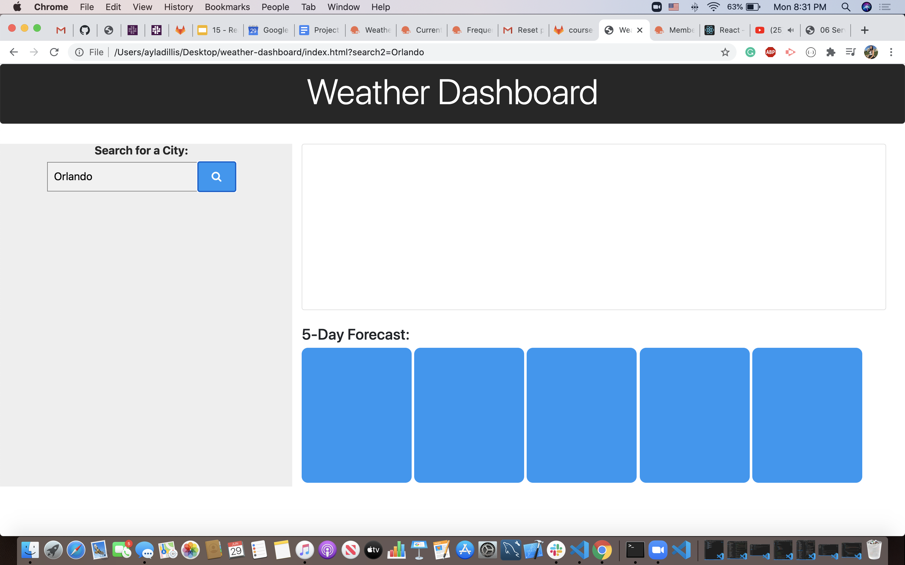

# Weather-Dashboard

Learning to work with APIs using the Open Weather Maps site!

## Tools

* OpenWeatherMap
* Zoom
* Slack
* GitHub
* GitLab
* BootCamp Code Drills
* Slack Overflow
* Google
* Youtube
* w3School
* MDN Webdocs
* Ramon Sanchez (my tutor)

## Screenshots

* a split screen image of my html and javascript where I am attempting to display the weather details such as humidity, wind-speed and city name using div tags linking to my jquery. 

* I'm really happy with how my front end turned out!

## Code Snippets

* using the 16-all-together activity form class I attempted to get my search button working, I need to work on learning when and where to use jquery. 

   $("#search").on("click", function(event){
    event.preventDefault();
    $("#city-info").empty();
    $(".city-button").removeClass("active");
    $(this).addClass("active");

    console.log("button clicked")
    populateButtons();

* I was able to get my OpenWeatherMap API to show in my console however not on my browser page, I am glade I was able to figure out how to add the queryURL with my key now I just need a differrent approach when trying to figure out backend! 

 var cityName = cities[ 0 ]
    var queryURL = "http://api.openweathermap.org/data/2.5/weather?q=" + cityName +"&units=imperial&appid=6d62c1e57554dc6cee60932bdfd78a07"

## Deploy Link

* [Click for Live Site](https://ayladillis.github.io/weather-dashboard/)

## Authors 

Ayla Dillis

* [HTML](https://developer.mozilla.org/en-US/docs/Web/HTML)
* [CSS](https://developer.mozilla.org/en-US/docs/Web/CSS)
* [Javascript](https://developer.mozilla.org/en-US/docs/Web/JavaScrip)
* [JQuery](https://jquery.com/)
* [OpenWeatherMap](https://openweathermap.org/)